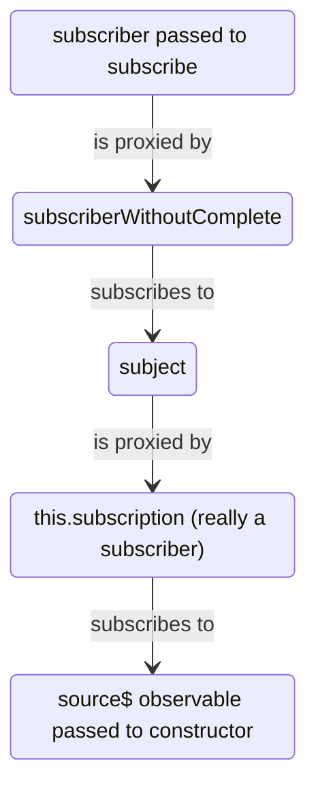

# state observable flow

```mermaid
stateDiagram-v2
    source: source$ observable passed to constructor
    swc: subscriberWithoutComplete
    ts: this.subscription (really a subscriber)
    subscriber: subscriber passed to subscribe
    subscriber --> swc: is proxied by
    swc --> subject: subscribes to
    subject --> ts: is proxied by
    ts --> source: subscribes to
```
